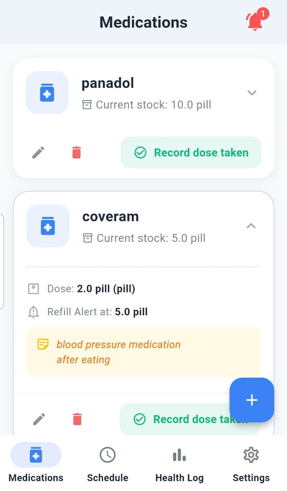
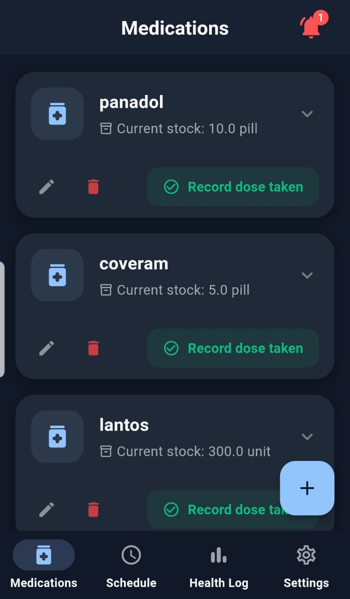
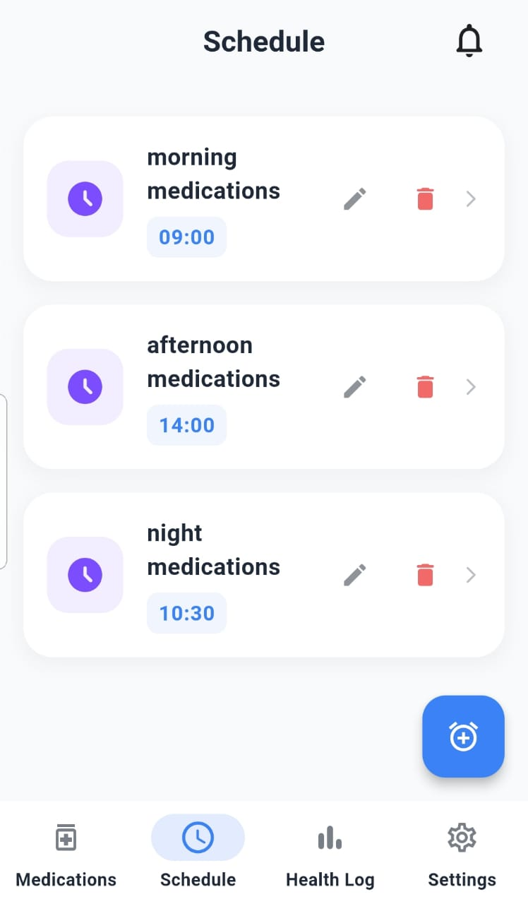
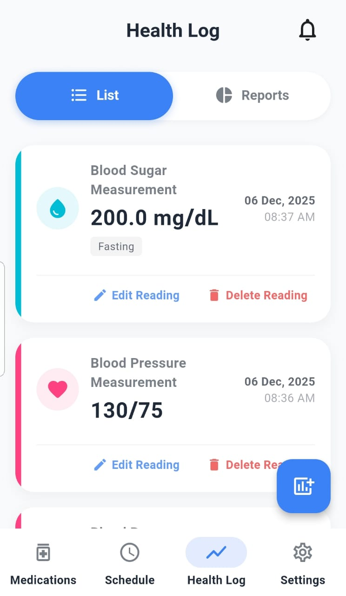
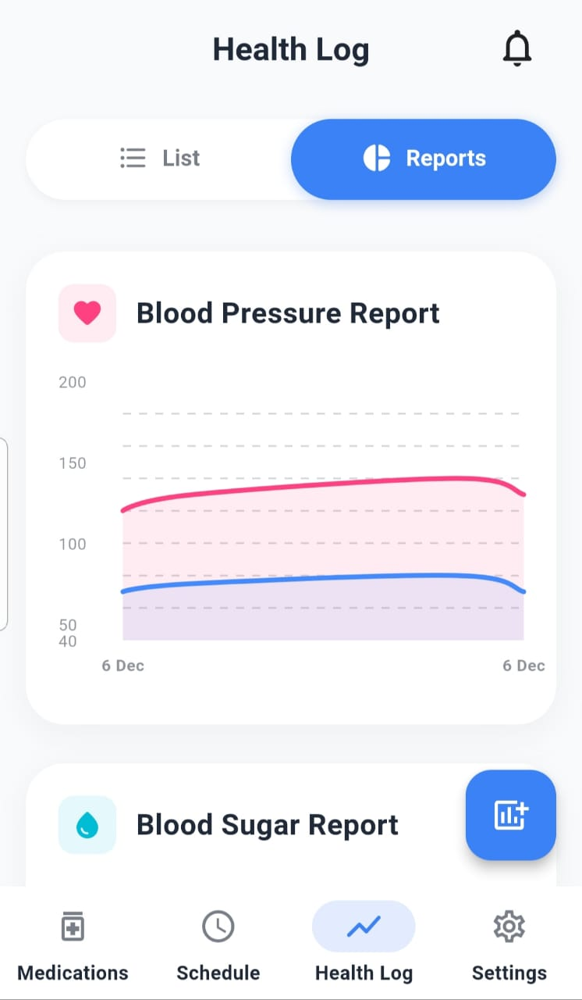
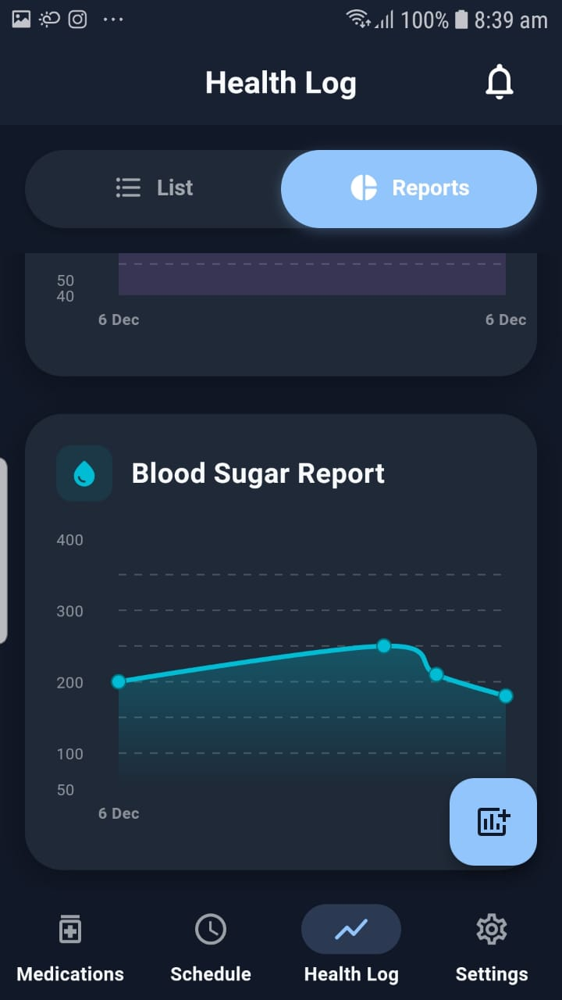

# 💊 Agzakhaneti (أجزخانتي)

A comprehensive, localized Flutter application for medication management, schedule tracking, and health monitoring, built with **Clean Architecture** and **Modern UI**.

## ✨ Features

* **💊 Medication Management:** Add, edit, and track medication stock with smart alerts.
* **📅 Schedule System:** Set recurrent schedules (e.g., Breakfast, Dinner) and link multiple medications to them.
* **📊 Health Log:** Track Blood Pressure and Blood Sugar levels with interactive charts and reports.
* **🔔 Smart Notifications:** Get reminded for doses and low stock alerts.
* **🌍 Localization:** Fully supported Arabic & English (RTL/LTR).
* **🌑 Dark/Light Mode:** Adaptive UI that respects system settings.
* **🎓 Interactive Tutorials:** In-app showcase tour for new users.

## 🛠 Tech Stack & Architecture

* **State Management:** `flutter_bloc` (Cubit)
* **Architecture:** Clean Architecture (Data, Domain, Presentation) with Repository Pattern.
* **DI:** `get_it` for dependency injection.
* **Local Storage:** `sqflite` for robust data persistence.
* **UI/UX:**
    * Material 3 Design.
    * `fl_chart` for health analytics.
    * `showcaseview` for user onboarding.
    * `Youtubeer_flutter` for video tutorials.
* **Date & Time:** `intl` package.

## 📸 Screenshots

### 🏠 Home & Schedule (Light vs Dark)
| Home (Light) | Home (Dark) | Schedule |
|:---:|:---:|:---:|
|  |  |  |

### 📊 Health Analytics & Reports
| Health Log List | Charts (Light) | Charts (Dark) |
|:---:|:---:|:---:|
|  |  |  |

## 🚀 How to Run

1.  Clone the repo:
    ```bash
    git clone [https://github.com/hazemm900/agzakhaneti.git](https://github.com/hazemm900/agzakhaneti.git)
    ```
2.  Install dependencies:
    ```bash
    flutter pub get
    ```
3.  Run the app:
    ```bash
    flutter run
    ```

---
Developed with ❤️ by **Hazem Hefny** using Flutter.